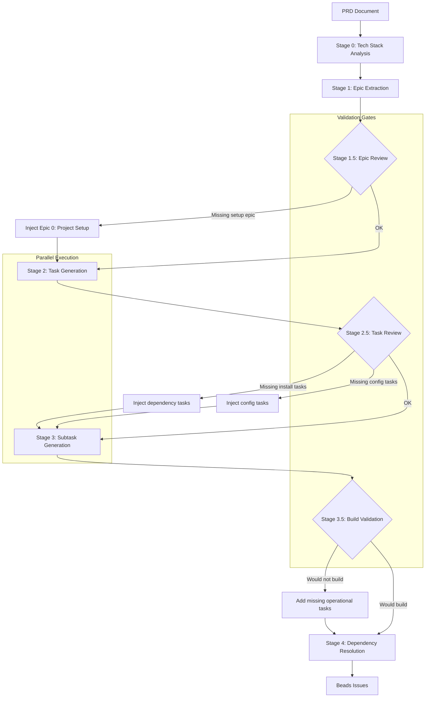

# PRD Parsing Architecture

## Current Flow: Multi-Stage Parallel Parsing

```
┌─────────────────────────────────────────────────────────────────────────────┐
│                              PRD DOCUMENT                                    │
│                         (Product Requirements)                               │
└─────────────────────────────────────────────────────────────────────────────┘
                                    │
                                    ▼
┌─────────────────────────────────────────────────────────────────────────────┐
│                         STAGE 1: EPIC EXTRACTION                             │
│                                                                              │
│  • Parse PRD for major features/milestones                                   │
│  • Extract project context (tech stack, users, goals)                        │
│  • Identify high-level epic structure                                        │
│  • NO tasks or subtasks yet                                                  │
│                                                                              │
│  Output: 3-8 Epics with descriptions, acceptance criteria                    │
└─────────────────────────────────────────────────────────────────────────────┘
                                    │
                    ┌───────────────┼───────────────┐
                    ▼               ▼               ▼
┌─────────────────────────────────────────────────────────────────────────────┐
│                    STAGE 2: TASK GENERATION (PARALLEL)                       │
│                                                                              │
│  ┌─────────────┐    ┌─────────────┐    ┌─────────────┐                      │
│  │   Epic 1    │    │   Epic 2    │    │   Epic 3    │   ...                │
│  │      │      │    │      │      │    │      │      │                      │
│  │      ▼      │    │      ▼      │    │      ▼      │                      │
│  │  3-8 Tasks  │    │  3-8 Tasks  │    │  3-8 Tasks  │                      │
│  └─────────────┘    └─────────────┘    └─────────────┘                      │
│                                                                              │
│  Each epic processed in parallel (semaphore: 3 concurrent)                   │
│  Output: Tasks with design notes, priorities, dependencies                   │
└─────────────────────────────────────────────────────────────────────────────┘
                                    │
          ┌─────────────────────────┼─────────────────────────┐
          ▼                         ▼                         ▼
┌─────────────────────────────────────────────────────────────────────────────┐
│                  STAGE 3: SUBTASK GENERATION (PARALLEL)                      │
│                                                                              │
│  ┌────────┐ ┌────────┐ ┌────────┐ ┌────────┐ ┌────────┐ ┌────────┐         │
│  │Task 1.1│ │Task 1.2│ │Task 2.1│ │Task 2.2│ │Task 3.1│ │Task 3.2│  ...    │
│  │   │    │ │   │    │ │   │    │ │   │    │ │   │    │ │   │    │         │
│  │   ▼    │ │   ▼    │ │   ▼    │ │   ▼    │ │   ▼    │ │   ▼    │         │
│  │2-6 subs│ │2-6 subs│ │2-6 subs│ │2-6 subs│ │2-6 subs│ │2-6 subs│         │
│  └────────┘ └────────┘ └────────┘ └────────┘ └────────┘ └────────┘         │
│                                                                              │
│  All tasks processed in parallel (semaphore: 5 concurrent)                   │
│  Output: Atomic subtasks with testing requirements                           │
└─────────────────────────────────────────────────────────────────────────────┘
                                    │
                                    ▼
┌─────────────────────────────────────────────────────────────────────────────┐
│                         OUTPUT: BEADS ISSUES                                 │
│                                                                              │
│  Creates hierarchical issues with readable IDs:                              │
│  • test-e1 (Epic)                                                            │
│    • test-e1t1 (Task)                                                        │
│      • test-e1t1s1 (Subtask)                                                 │
│      • test-e1t1s2 (Subtask)                                                 │
│    • test-e1t2 (Task)                                                        │
│  • test-e2 (Epic)                                                            │
│    ...                                                                       │
└─────────────────────────────────────────────────────────────────────────────┘
```

## Problem: Missing Practical Steps

LLMs often miss critical operational steps:

```
❌ WHAT LLMS MISS:
┌─────────────────────────────────────────────────────────────────────────────┐
│  Project Setup                                                               │
│  ├── ✗ Initialize package manager (bun init, npm init)                       │
│  ├── ✗ Install dependencies after adding them                                │
│  ├── ✗ Database migrations after schema changes                              │
│  ├── ✗ Environment variable setup                                            │
│  └── ✗ Development server restart requirements                               │
│                                                                              │
│  Build Pipeline                                                              │
│  ├── ✗ Type generation (prisma generate, convex dev)                         │
│  ├── ✗ Build verification after changes                                      │
│  ├── ✗ Linting and formatting                                                │
│  └── ✗ CI/CD pipeline setup                                                  │
│                                                                              │
│  Runtime Requirements                                                        │
│  ├── ✗ Service dependencies (Redis, Postgres, etc.)                          │
│  ├── ✗ API key configuration                                                 │
│  └── ✗ Third-party service setup (Clerk, Stripe, etc.)                       │
└─────────────────────────────────────────────────────────────────────────────┘
```

## Proposed: Enhanced Flow with Validation Stages

```
┌─────────────────────────────────────────────────────────────────────────────┐
│                              PRD DOCUMENT                                    │
└─────────────────────────────────────────────────────────────────────────────┘
                                    │
                                    ▼
┌─────────────────────────────────────────────────────────────────────────────┐
│                    STAGE 0: TECH STACK ANALYSIS (NEW)                        │
│                                                                              │
│  Analyze PRD for:                                                            │
│  • Package managers (bun, npm, pnpm, yarn)                                   │
│  • Frameworks (Next.js, Convex, Prisma, etc.)                                │
│  • External services (Clerk, Telnyx, Stripe, etc.)                           │
│  • Database requirements                                                     │
│  • Build tools                                                               │
│                                                                              │
│  Output: TechStackAnalysis with required setup steps                         │
└─────────────────────────────────────────────────────────────────────────────┘
                                    │
                                    ▼
┌─────────────────────────────────────────────────────────────────────────────┐
│                         STAGE 1: EPIC EXTRACTION                             │
│                              (same as before)                                │
└─────────────────────────────────────────────────────────────────────────────┘
                                    │
                                    ▼
┌─────────────────────────────────────────────────────────────────────────────┐
│                    STAGE 1.5: EPIC REVIEW (NEW)                              │
│                                                                              │
│  Validate epic structure:                                                    │
│  □ Does Epic 0/1 cover project initialization?                               │
│  □ Are infrastructure dependencies identified?                               │
│  □ Is there a "Project Setup" or "Foundation" epic?                          │
│  □ Are acceptance criteria testable?                                         │
│                                                                              │
│  Auto-inject if missing:                                                     │
│  • "Epic 0: Project Initialization" (always first)                           │
│  • Required setup tasks based on tech stack                                  │
└─────────────────────────────────────────────────────────────────────────────┘
                                    │
                                    ▼
┌─────────────────────────────────────────────────────────────────────────────┐
│                    STAGE 2: TASK GENERATION (PARALLEL)                       │
│                              (same as before)                                │
└─────────────────────────────────────────────────────────────────────────────┘
                                    │
                                    ▼
┌─────────────────────────────────────────────────────────────────────────────┐
│                    STAGE 2.5: TASK REVIEW (NEW)                              │
│                                                                              │
│  Validate task completeness:                                                 │
│  □ Every dependency addition has install step?                               │
│  □ Schema changes have migration tasks?                                      │
│  □ API integrations have credential setup?                                   │
│  □ Build tasks exist for generated code?                                     │
│                                                                              │
│  Checklist by tech stack:                                                    │
│  ┌─────────────────────────────────────────────────────────┐                │
│  │ Convex:                                                  │                │
│  │ □ npx convex dev (initial setup)                         │                │
│  │ □ Schema changes → regenerate types                      │                │
│  │ □ Function changes → hot reload check                    │                │
│  ├─────────────────────────────────────────────────────────┤                │
│  │ Clerk:                                                   │                │
│  │ □ Create application in Clerk dashboard                  │                │
│  │ □ Configure OAuth providers                              │                │
│  │ □ Set CLERK_* environment variables                      │                │
│  ├─────────────────────────────────────────────────────────┤                │
│  │ Telnyx:                                                  │                │
│  │ □ Create Telnyx account and project                      │                │
│  │ □ Purchase phone number                                  │                │
│  │ □ Configure webhook URLs                                 │                │
│  │ □ Set TELNYX_* environment variables                     │                │
│  └─────────────────────────────────────────────────────────┘                │
└─────────────────────────────────────────────────────────────────────────────┘
                                    │
                                    ▼
┌─────────────────────────────────────────────────────────────────────────────┐
│                  STAGE 3: SUBTASK GENERATION (PARALLEL)                      │
│                              (same as before)                                │
└─────────────────────────────────────────────────────────────────────────────┘
                                    │
                                    ▼
┌─────────────────────────────────────────────────────────────────────────────┐
│                    STAGE 3.5: BUILD VALIDATION (NEW)                         │
│                                                                              │
│  Final review asking:                                                        │
│  "If an agent follows these tasks in order, will the project build?"         │
│                                                                              │
│  Check for:                                                                  │
│  □ Can run `bun install` / `npm install` successfully?                       │
│  □ Can run `bun run dev` / `npm run dev`?                                    │
│  □ Are all environment variables documented?                                 │
│  □ Are all external services configured?                                     │
│  □ Are database migrations applied?                                          │
│  □ Are types generated?                                                      │
│                                                                              │
│  If gaps found → inject missing tasks with correct dependencies              │
└─────────────────────────────────────────────────────────────────────────────┘
                                    │
                                    ▼
┌─────────────────────────────────────────────────────────────────────────────┐
│                         STAGE 4: DEPENDENCY RESOLUTION                       │
│                                                                              │
│  Ensure correct execution order:                                             │
│  • Setup tasks → Implementation tasks                                        │
│  • Schema tasks → Code that uses schema                                      │
│  • Install tasks → Tasks that use installed packages                         │
│  • Config tasks → Tasks that need config                                     │
│                                                                              │
│  Build dependency graph and validate no cycles                               │
└─────────────────────────────────────────────────────────────────────────────┘
                                    │
                                    ▼
┌─────────────────────────────────────────────────────────────────────────────┐
│                         OUTPUT: BEADS ISSUES                                 │
│                                                                              │
│  Complete, buildable project structure                                       │
└─────────────────────────────────────────────────────────────────────────────┘
```

## Tech Stack Checklists

These would be auto-injected based on detected tech stack:

### Convex Projects
```
□ Initialize Convex project (npx convex dev)
□ Create schema.ts with data models
□ Generate TypeScript types
□ Set up Convex provider in _app.tsx
□ Configure environment variables (CONVEX_DEPLOYMENT, NEXT_PUBLIC_CONVEX_URL)
```

### Next.js + Clerk
```
□ Install @clerk/nextjs
□ Create Clerk application
□ Configure ClerkProvider
□ Set up middleware.ts for auth
□ Configure environment variables (CLERK_SECRET_KEY, NEXT_PUBLIC_CLERK_*)
```

### Telnyx Voice
```
□ Create Telnyx account
□ Create TeXML application
□ Purchase phone number
□ Configure webhook endpoints
□ Set environment variables (TELNYX_API_KEY, TELNYX_APP_ID)
□ Test webhook connectivity
```

### General JavaScript/TypeScript
```
□ Initialize package manager (bun init / npm init)
□ Install dependencies after package.json changes
□ Run type checking (tsc --noEmit)
□ Run linting (eslint)
□ Run tests before commit
```

## Mermaid Diagram: Full Flow



## Implementation Priority

1. **Phase 1** (Current): Multi-stage parallel parsing ✅
2. **Phase 2** (Next): Tech stack analysis + auto-injection
3. **Phase 3** (Future): Build validation stage
4. **Phase 4** (Future): Interactive review mode

## Questions for Implementation

1. Should validation stages be synchronous (blocking) or advisory (warnings)?
2. Should we maintain a library of tech-stack-specific checklists?
3. Should the "build validation" stage actually try to generate a build script?
4. Should users be able to provide their own validation rules?
