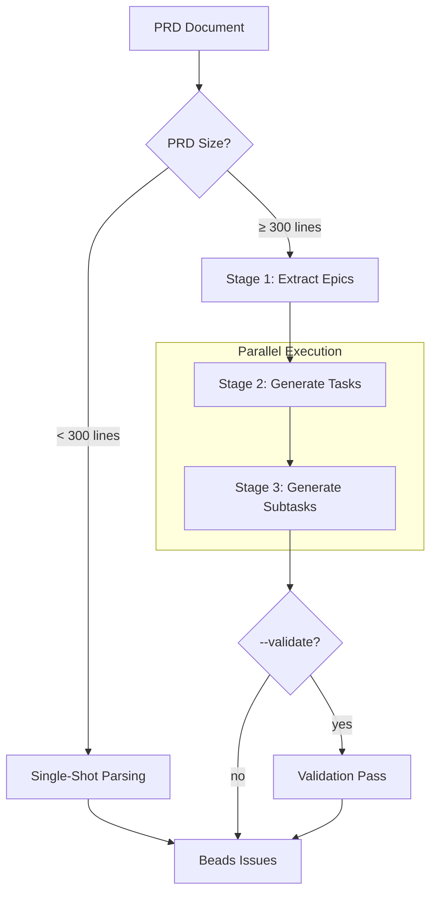

# PRD Parsing Architecture

## Smart Parsing (Default)

prd-parser automatically chooses the best strategy based on PRD size:

- **Small PRDs** (< 300 lines): Single-shot parsing
- **Large PRDs** (≥ 300 lines): Multi-stage parallel parsing

Override with `--single-shot` or `--multi-stage` flags.

## Single-Shot Parsing

Used for smaller PRDs. One LLM call generates the entire structure:

```
┌─────────────────────────────────────────────────────────────────────────────┐
│                              PRD DOCUMENT                                    │
└─────────────────────────────────────────────────────────────────────────────┘
                                    │
                                    ▼
┌─────────────────────────────────────────────────────────────────────────────┐
│                         SINGLE LLM CALL                                      │
│                                                                              │
│  • Parse PRD for epics, tasks, subtasks                                      │
│  • Extract project context                                                   │
│  • Generate all hierarchical structure                                       │
│                                                                              │
└─────────────────────────────────────────────────────────────────────────────┘
                                    │
                                    ▼
┌─────────────────────────────────────────────────────────────────────────────┐
│                         OUTPUT: BEADS ISSUES                                 │
└─────────────────────────────────────────────────────────────────────────────┘
```

## Multi-Stage Parallel Parsing

Used for larger PRDs. Breaks work into focused stages with parallel execution:

```
┌─────────────────────────────────────────────────────────────────────────────┐
│                              PRD DOCUMENT                                    │
│                         (Product Requirements)                               │
└─────────────────────────────────────────────────────────────────────────────┘
                                    │
                                    ▼
┌─────────────────────────────────────────────────────────────────────────────┐
│                         STAGE 1: EPIC EXTRACTION                             │
│                                                                              │
│  • Parse PRD for major features/milestones                                   │
│  • Extract project context (tech stack, users, goals)                        │
│  • Identify high-level epic structure                                        │
│  • NO tasks or subtasks yet                                                  │
│                                                                              │
│  Output: 3-8 Epics with descriptions, acceptance criteria                    │
└─────────────────────────────────────────────────────────────────────────────┘
                                    │
                    ┌───────────────┼───────────────┐
                    ▼               ▼               ▼
┌─────────────────────────────────────────────────────────────────────────────┐
│                    STAGE 2: TASK GENERATION (PARALLEL)                       │
│                                                                              │
│  ┌─────────────┐    ┌─────────────┐    ┌─────────────┐                      │
│  │   Epic 1    │    │   Epic 2    │    │   Epic 3    │   ...                │
│  │      │      │    │      │      │    │      │      │                      │
│  │      ▼      │    │      ▼      │    │      ▼      │                      │
│  │  3-8 Tasks  │    │  3-8 Tasks  │    │  3-8 Tasks  │                      │
│  └─────────────┘    └─────────────┘    └─────────────┘                      │
│                                                                              │
│  Each epic processed in parallel (semaphore: 3 concurrent)                   │
│  Output: Tasks with design notes, priorities, dependencies                   │
└─────────────────────────────────────────────────────────────────────────────┘
                                    │
          ┌─────────────────────────┼─────────────────────────┐
          ▼                         ▼                         ▼
┌─────────────────────────────────────────────────────────────────────────────┐
│                  STAGE 3: SUBTASK GENERATION (PARALLEL)                      │
│                                                                              │
│  ┌────────┐ ┌────────┐ ┌────────┐ ┌────────┐ ┌────────┐ ┌────────┐         │
│  │Task 1.1│ │Task 1.2│ │Task 2.1│ │Task 2.2│ │Task 3.1│ │Task 3.2│  ...    │
│  │   │    │ │   │    │ │   │    │ │   │    │ │   │    │ │   │    │         │
│  │   ▼    │ │   ▼    │ │   ▼    │ │   ▼    │ │   ▼    │ │   ▼    │         │
│  │2-6 subs│ │2-6 subs│ │2-6 subs│ │2-6 subs│ │2-6 subs│ │2-6 subs│         │
│  └────────┘ └────────┘ └────────┘ └────────┘ └────────┘ └────────┘         │
│                                                                              │
│  All tasks processed in parallel (semaphore: 5 concurrent)                   │
│  Retry logic: Up to 2 retries on parse errors                                │
│  Output: Atomic subtasks with testing requirements                           │
└─────────────────────────────────────────────────────────────────────────────┘
                                    │
                                    ▼
┌─────────────────────────────────────────────────────────────────────────────┐
│                         OUTPUT: BEADS ISSUES                                 │
│                                                                              │
│  Creates hierarchical issues with readable IDs:                              │
│  • test-e1 (Epic)                                                            │
│    • test-e1t1 (Task)                                                        │
│      • test-e1t1s1 (Subtask)                                                 │
│      • test-e1t1s2 (Subtask)                                                 │
│    • test-e1t2 (Task)                                                        │
│  • test-e2 (Epic)                                                            │
│    ...                                                                       │
└─────────────────────────────────────────────────────────────────────────────┘
```

## Optional Validation Pass

With `--validate`, an additional LLM review checks for gaps:

```
┌─────────────────────────────────────────────────────────────────────────────┐
│                         VALIDATION PASS (Optional)                           │
│                                                                              │
│  Asks LLM to review complete plan and identify:                              │
│  • Missing setup/initialization tasks                                        │
│  • Backend without UI to test it                                             │
│  • Dependencies not installed                                                │
│  • Acceptance criteria that can't be verified                                │
│  • Tasks in wrong order                                                      │
│                                                                              │
│  Output: Warnings printed to console (does not modify plan)                  │
└─────────────────────────────────────────────────────────────────────────────┘
```

## Error Handling

- **FlexibleString**: Handles LLM returning strings, arrays, booleans, or null
- **Stage 3 Retry**: Up to 2 retries on JSON parse errors
- **Checkpoint/Resume**: `--save-json` and `--from-json` for recovery

## Mermaid Diagram


